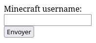
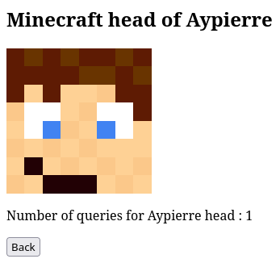

# A minimal minecraft head display server

A server to display a player head : enter the player username, and it will display its head skin.

## Main page

The main page asks for the username of a player

The page display_skin shows the head of the chosen player

The website save statistics about the queried heads inside a file name queried_names.json

# Setup

Requires python

- Install Flask : `pip install flask`
- Run the server : `flask --app flask_minimal.py run`

By default, the server is listening on port 5000